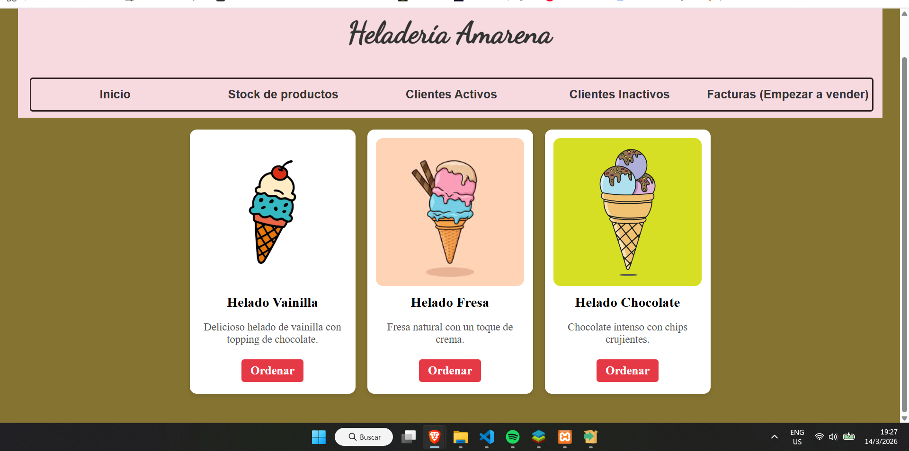
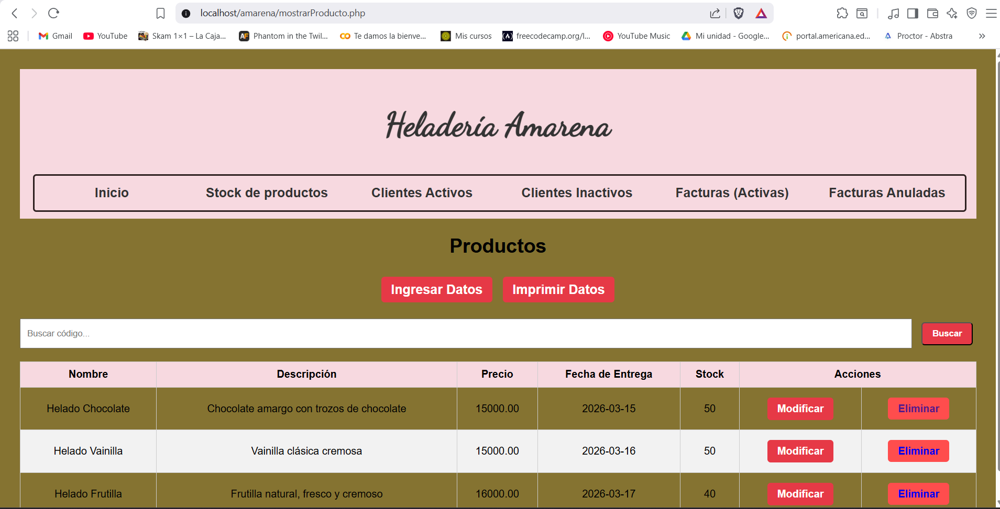
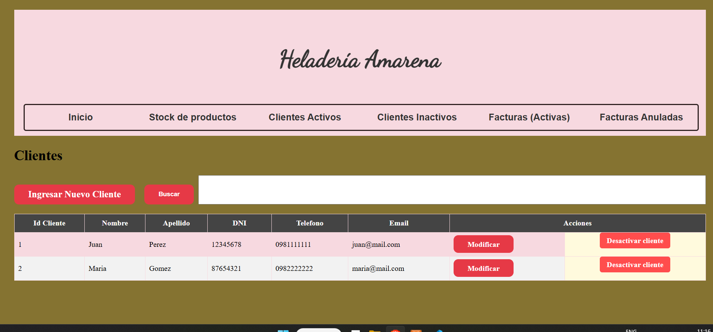

# Sistema de Facturación - Amarena

Es un sistema web para gestionar facturas, clientes y productos, proveedores, en donde tambien al final se genera un reporte de facturas en pdf o para impresion directa.

## Tecnologías utilizadas
- PHP
- MySQL
- HTML
- CSS

## Funcionalidades
- Crear, modificar, actualizar facturas
- Mostrar, crear, eliminar o desactivar productos
- Gestión de clientes, proveedores
## Capturas del sistema
## Inicio

## Stock

## Productos Inactivos
.
## Crear Factura
.
## Clientes 
.
